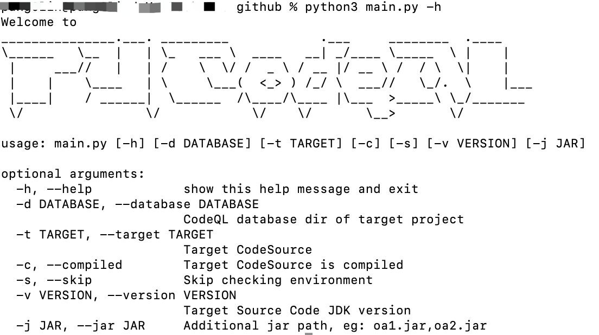

# CodeQLpy

## 项目简介

CodeQLpy是一款基于CodeQL实现的自动化代码审计工具，目前仅支持java语言，后期会增加对其他语言的支持。

支持对多种不同类型的java代码进行代码审计，包括jsp文件、SpringMVC的war包、SpringBoot的jar包、maven源代码。



-d: 指定待扫描的数据库，一般用于step3

-t: 指定待扫描的源码，源码可以支持文件夹，jar包和war包

-c: 指定源码是编译前源码还是编译后源码，一般需要使用此参数

-s: 是否进行环境检查，不建议跳过环境检查

-v: 指定待扫描的源码对应的jdk版本，默认是jdk8

-j: 指定源码中需要额外编译的jar包，用于步骤一，用法例如：oa1.jar,oa2.jar。支持通过正则的方式指定包名，例如oa.*?\.jar

-r: 指定目标网站根目录，仅在源码为文件夹类型有用，不指定默认为-t源码路径

## 安装准备

1、首先安装CodeQL，具体安装方法可以参考[CodeQL安装](https://www.freebuf.com/articles/web/283795.html)。注意一定要使用新版本，老版本中有不支持的语法

2、python环境依赖，本项目依赖python3.7及以上版本，具体依赖见requirements.txt

```
pip3 install -r requirements.txt
```

3、java环境依赖，本项目运行需要安装下面的java组件：JDK8、JDK11、maven。

4、修改config/config.ini文件，需要修改的配置项是qlpath和jdk8和jdk11，其他项目可保持默认。注意jdk的路径中有空格的话需要用双引号包裹。

```
[codeql]
qlpath = D:\CodeQL\ql\java\ql\test\
jdk8 = "C:\Program Files\Java\jre1.8.0_131\bin\java.exe"
jdk11 = "C:\Program Files\Java\jdk-11\bin\java.exe"
idea_decode_tool = lib/java-decompiler.jar
jd_decode_tool  = lib/jd-cli.jar
jsp_decode_tool = lib/jsp2class.jar
ecj_tool = lib/ecj-4.6.1.jar
tomcat_jar = lib/tomcat_lib
spring_boot_jar = lib/spring_boot_lib
decode_savedir = out/decode/
general_dbpath = out/database/
maven_savedir  = out/mvn/
decompile_type = jd
debug = on
model = fast
thread_num = 10

[log]
path = out/log/
```

## 项目使用

本项目的使用主要分成三个步骤，

**Step1, 生成数据库初始化**

```
python3 main.py -t /Users/xxx/Downloads/OAapp/ -c
```

参数解释，

-t参数表示目标源码的路径，支持的源码类型是文件夹，jar包和war包。注意如果是文件夹类型的源码，-t指定的路径必须是网站跟目录，不然会因为源码中相对路径错误导致编译异常。

-c表示源码是属于编译后的源码，即class文件。如果不指定，则表示源码为编译前源码，即java文件。

**Step2，生成数据库**

这一步直接使用上一步命令最终返回的生成数据库的命令在cmd/bash环境中运行即可

mac命令如下

```
arch -x86_64 codeql database create out/database/OAapp --language=java --command="/bin/bash -c /Users/xxx/CodeQLpy/out/decode/run.sh" --overwrite
```

windows命令如下

```
codeql database create out/database/OAapp --language=java --command="run.cmd" --overwrite
```

**Step3，代码审计**

这一步需要使用上一步命令最终相应的生成数据库的路径

```
python3 main.py -d /Users/xxx/CodeQLpy/out/database/OAapp/
```

-d 参数表示待扫描的数据库路径

运行完成之后最终会返回结果文件，结果文件是csv文件，保存目录在out/result/目录之下。

## CodeQLpy应用

CodeQLpy用于自动化分析常见WEB应用漏洞，包括但不限于SQL注入、XSS、命令执行、任意文件操作、XXE、SSRF、反序列化等。CodeQLpy不能用于挖掘反序列化利用链。

为什么不直接在lgtm网站上分析？

lgtm要求分析的源码一定是编译前的源码，而且其包含的插件有限，扩展性不够。

## 案例

案例一，[javasec测试用例](https://github.com/webraybtl/StudyCodeQLpy/tree/main/javasec_demo)

案例二，[若依RuoYi测试用例](https://github.com/webraybtl/StudyCodeQLpy/tree/main/ruoyi_demo)

案例三，[SpringMVC测试用例](https://github.com/webraybtl/StudyCodeQLpy/tree/main/springmvc_demo)
## 联系作者
如果有任何疑问，联系作者微信@ppdevxin

## 免责声明:

本篇文章仅用于技术交流学习和研究的目的，严禁使用文章中的技术用于非法目的和破坏，否则造成一切后果与发表本文章的作者无关。

### 中文版本:

本免责声明旨在明确指出，本文仅为技术交流、学习和研究之用，不得将文章中的技术用于任何非法目的或破坏行为。发表本文章的作者对于任何非法使用技术或对他人或系统造成的损害概不负责。

阅读和参考本文章时，您必须明确并承诺，不会利用文章中提供的技术来实施非法活动、侵犯他人的权益或对系统进行攻击。任何使用本文中的技术所导致的任何意外、损失或损害，包括但不限于数据损失、财产损失、法律责任等问题，都与发表本文章的作者无关。

本文提供的技术信息仅供学习和参考之用，不构成任何形式的担保或保证。发表本文章的作者不对技术的准确性、有效性或适用性做任何声明或保证。

### 英文版本:

This disclaimer is intended to clearly state that this article is solely for the purpose of technical exchange, learning, and research, and the use of the techniques mentioned in the article for any illegal purposes or destructive actions is strictly prohibited. The author of this article shall not be held responsible for any consequences resulting from the misuse of the techniques mentioned.

By reading and referring to this article, you must acknowledge and commit that you will not exploit the techniques provided in the article for any illegal activities, infringement of rights of others, or attacks on systems. The author of this article bears no responsibility for any accidents, losses, or damages caused by the use of the techniques mentioned in this article, including but not limited to data loss, property damage, legal liabilities, etc.

The technical information provided in this article is for learning and reference purposes only and does not constitute any form of warranty or guarantee. The author of this article makes no representations or warranties regarding the accuracy, effectiveness, or applicability of the techniques mentioned.
